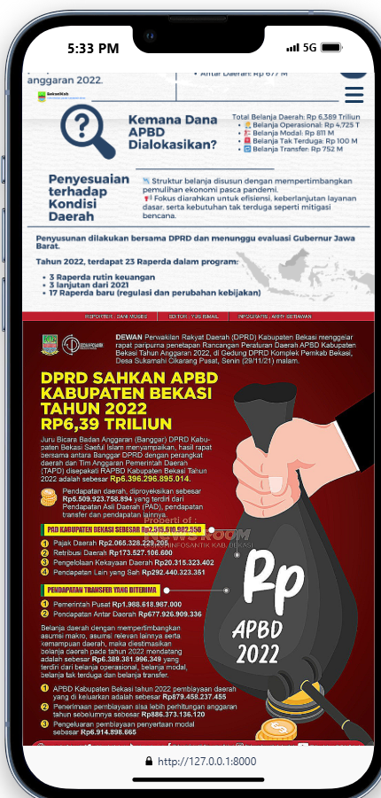

# Proyek APBD Bekasi

Ini adalah proyek aplikasi web berbasis Django yang didesain untuk menyediakan informasi transparan mengenai Anggaran Pendapatan dan Belanja Daerah (APBD) Kota Bekasi. Aplikasi ini bertujuan untuk memudahkan masyarakat dalam mengakses data anggaran, berita terkini, dan dokumen terkait APBD.

---

## Tampilan Aplikasi

Berikut adalah beberapa tampilan antarmuka pengguna (UI) dari aplikasi APBD Bekasi:

### Halaman Beranda
Menampilkan ringkasan dan navigasi utama aplikasi.


### Tampilan Detail Data
Contoh tampilan halaman yang menyajikan detail data APBD.


### Halaman Tanya Jawab Umum (FAQ)
Berisi daftar pertanyaan dan jawaban umum seputar APBD Bekasi.


### Halaman Unduh Dokumen
Tempat pengguna dapat mengunduh dokumen-dokumen penting terkait anggaran.


---

## Fitur Utama

* **Dashboard Interaktif:** Menampilkan ringkasan APBD tahunan dan perbandingan data.
* **Informasi Berita:** Bagian khusus untuk berita atau pengumuman terkait anggaran.
* **Unduh Dokumen:** Memungkinkan pengguna untuk mengunduh laporan atau dokumen resmi APBD dalam format PDF.
* **FAQ:** Bagian tanya jawab untuk membantu pengguna memahami informasi lebih lanjut.
* **Responsif:** Tampilan yang adaptif di berbagai perangkat (desktop, tablet, mobile).

---

## Cara Menjalankan Proyek (Lokal)

Ikuti langkah-langkah di bawah ini untuk menjalankan proyek APBD Bekasi di lingkungan lokal Anda:

1.  **Clone repositori:**
    Buka Terminal atau Command Prompt dan jalankan perintah berikut:
    ```bash
    git clone https://github.com/GABRIELBOSSTON/porojekprosesapbd.git
